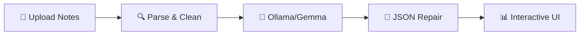

# 📚 StudyBuddy AI

> **Your offline-first AI study companion** — Transform lecture notes into interactive quizzes, flashcards, and mock viva questions using local AI.

Built for the **Hacktoberfest Weekend Challenge** — *"Build for a Friend"*


---

## ✨ Features

- 🎯 **Quiz Mode** — MCQs with hints, explanations, and visual feedback
- 🃏 **Flashcards** — 3D flip cards for concept/definition review
- 🎓 **Mock Viva** — Practice open-ended questions with model answers
- 📂 **Multi-format Upload** — PDF, Markdown, and plain text support
- 🔒 **100% Local** — All AI processing runs on your machine via Ollama
- 🌙 **Premium Dark UI** — Glassmorphism design with smooth animations

---

## 🏗️ Tech Stack

| Layer | Technology |
| :--- | :--- |
| **Frontend** | React 19, Vite, Tailwind CSS v4, Framer Motion, Lucide Icons |
| **Backend** | Node.js, Express.js |
| **AI Engine** | Ollama + Gemma (gemma:2b or gemma:7b) |
| **File Parsing** | pdf-parse, custom Markdown/text cleaners |

---

## 🚀 Getting Started

### Prerequisites

- [Node.js](https://nodejs.org/) v18+ installed
- [Ollama](https://ollama.com/download) installed

### 1. Install Ollama & Pull a Gemma Model

You can pull and use **any Gemma model** supported by Ollama. Choose based on your hardware specs:

```bash
# Option A: Lightweight & fast (Recommended for most laptops - ~1.6 GB)
ollama pull gemma:2b

# Option B: Gemma 2 (Latest generation, compact - ~1.6 GB)
ollama pull gemma2:2b

# Option C: Higher accuracy (Requires 8GB+ RAM / VRAM - ~5.0 GB)
ollama pull gemma:7b

# Option D: Gemma 2 9B (High capability - ~5.5 GB)
ollama pull gemma2:9b
```

> **Tip:** You can set your preferred model in `backend/.env` via `OLLAMA_MODEL=gemma2:2b` or pass it per request.

Start the Ollama server (it typically auto-starts on system boot):

```bash
ollama serve
```

### 2. Clone & Install

```bash
git clone https://github.com/your-username/studybuddy-ai.git
cd studybuddy-ai

# Install frontend dependencies
npm install

# Install backend dependencies
cd backend
npm install
cd ..
```

### 3. Launch the App

Open **two terminals**:

**Terminal 1 — Backend:**

```bash
cd backend
npm run dev
```

**Terminal 2 — Frontend:**

```bash
npm run dev
```

The app will be available at [http://localhost:5173](http://localhost:5173)

---

## 📁 Project Structure

```text
StudyBuddy_AI/
├── backend/
│   ├── server.js              # Express server with API routes
│   ├── utils/
│   │   ├── ollama.js          # Ollama API wrapper & prompt engineering
│   │   ├── parser.js          # PDF/MD/TXT file parser
│   │   └── jsonRepair.js      # JSON extraction & repair from LLM output
│   └── package.json
├── src/
│   ├── App.jsx                # Main app with screen routing
│   ├── main.jsx               # React entry point
│   ├── index.css              # Tailwind v4 + design system
│   ├── components/
│   │   ├── Navbar.jsx         # Glass nav with Ollama status
│   │   ├── UploadScreen.jsx   # Drag-drop upload + text paste
│   │   ├── Dashboard.jsx      # Mode selection cards
│   │   ├── QuizPlayer.jsx     # Interactive MCQ player
│   │   ├── FlashcardDeck.jsx  # 3D flip card deck
│   │   ├── MockViva.jsx       # Viva question practice
│   │   ├── OllamaAlert.jsx    # Setup instructions alert
│   │   └── LoadingScreen.jsx  # AI generation loading state
│   ├── services/
│   │   └── api.js             # API service layer
│   └── data/
│       └── sampleData.js      # Demo data & sample notes
├── index.html
├── vite.config.js
├── package.json
└── README.md
```

---

## 🧠 How It Works

1. **Upload** your lecture notes (PDF, Markdown, or plain text)
2. The backend **parses** and cleans the text content
3. A carefully crafted prompt is sent to **Ollama's Gemma model** running locally
4. The AI generates structured JSON with quizzes, flashcards, and viva questions
5. A **JSON repair layer** handles any formatting quirks from the model
6. The interactive React frontend renders the study material



---

## 🔧 Configuration

| Environment Variable | Default | Description |
| :--- | :--- | :--- |
| `PORT` | `3001` | Backend server port |
| `OLLAMA_URL` | `http://localhost:11434` | Ollama API endpoint |
| `OLLAMA_MODEL` | `gemma:2b` | Model to use for generation |

---

## 🌍 Why Open Innovation Matters for StudyBuddy AI

StudyBuddy AI embodies the spirit of open innovation by combining three powerful principles:

### 🔓 Open-Source AI

By using **Gemma** through **Ollama**, StudyBuddy AI demonstrates that powerful AI doesn't require expensive API subscriptions or cloud dependencies. Students anywhere — regardless of internet connectivity or financial resources — can access intelligent study tools. This democratization of AI is fundamental to educational equity.

### 🏠 Local-First Architecture

All AI processing happens **on your machine**. Your study notes never leave your computer. In a world of increasing concern about data privacy, StudyBuddy AI proves that powerful AI applications can be built with a privacy-first mindset. No cloud. No data harvesting. No surveillance.

### 🤝 Community-Driven Development

Built for Hacktoberfest, StudyBuddy AI invites contributors to improve and extend the platform. Whether it's adding new quiz formats, supporting more file types, improving the AI prompts, or translating the interface — every contribution makes education more accessible. Open source means:

- **Transparency** — Anyone can audit how the AI generates content
- **Adaptability** — Teachers can customize it for their specific curriculum
- **Sustainability** — The project lives beyond any single developer

### 💡 The Bigger Picture

When we build study tools openly, we're not just writing code — we're investing in the idea that **technology should serve everyone equally**. A student in a remote village with a modest laptop and no internet can use StudyBuddy AI just as effectively as a student at a well-funded university.

**That's the power of open innovation: technology that lifts everyone up.**

---

## 📝 License

MIT License — see [LICENSE](LICENSE) for details.

---

## 🤝 Contributing

Contributions are welcome! Whether it's:

- 🐛 Bug fixes
- ✨ New features (speech-to-text for viva answers, spaced repetition, etc.)
- 🎨 UI improvements
- 📖 Documentation
- 🌐 Translations

Please open an issue first to discuss what you'd like to change.

---

### Built with Passion for Hacktoberfest 2026

*Because every student deserves an AI study buddy.*
